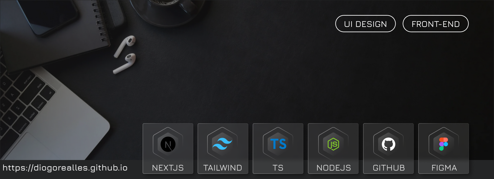
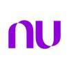

# 👋 <b>[Seu Nome 🡽](https://www.linkedin.com/in/diogorealles)</b>

### <b>Desenvolvedor Web Front-end</b> | <b>Sua área</b> 

## <b>Sobre mim</b>

Fale um pouco sobre você, hobbies, etc.  

# <b>Experiências</b>

Experiências de trabalho mais recente:

**Front-end.** 
[**Nubank**](https://nubank.com.br/) • 2023 - 2024 | Full-time

Linguagens & Tecnologias: 

Projetos em destaque: <b>[Nubank](https://nubank.com.br/)</b> 
Como 𝗱𝗲𝘀𝗲𝗻𝘃𝗼𝗹𝘃𝗲𝗱𝗼𝗿 𝘄𝗲𝗯 𝗙𝗿𝗼𝗻𝘁-𝗲𝗻𝗱, sou responsável pelo desenvolvimento e entrega de projetos nas tecnologias: 𝗛𝗧𝗠𝗟 𝗖𝗦𝗦 𝗦𝗔𝗦𝗦 𝗝𝗮𝘃𝗮𝗦𝗰𝗿𝗶𝗽𝘁 𝗡𝗲𝘅𝘁𝗝𝗦𝟭𝟯 𝗧𝗮𝗶𝗹𝘄𝗶𝗻𝗱𝗖𝗦𝗦
 

Utilizando ferramentas de interfaces como 𝗙𝗶𝗴𝗺𝗮 e para avaliação dos layouts. 
Assegurando um fluxo constante de entregas com 𝗠𝗲𝗹𝗵𝗼𝗿𝗲𝘀 𝗣𝗿𝗮́𝘁𝗶𝗰𝗮𝘀 de código e alto nível de 𝗣𝗲𝗿𝗳𝗼𝗿𝗺𝗮𝗻𝗰𝗲 e 𝗦𝗘𝗢 e 𝗔𝗰𝗲𝘀𝘀𝗶𝗯𝗶𝗹𝗶𝗱𝗮𝗱𝗲. 

Utilizando conceitos de gitflow com versionamento de códigos com 𝗚𝗶𝘁 e 𝗚𝗶𝘁𝗵𝘂𝗯/𝗕𝗶𝘁𝗯𝘂𝗰𝗸𝗲𝘁. 
Fui destacado a participar de projetos de grandes clientes como: Setin, Archote, Trisul e outros. 
Minha facilidade de comunicação e conhecimentos e habilidades multidisciplinares em 𝗨𝗜 𝗗𝗲𝘀𝗶𝗴𝗻 e 𝗕𝗮𝗰𝗸-𝗲𝗻𝗱 me permitiram auxiliar e trabalhar e cooperar com equipe de Designer e Back-end e a supervisão de QA para garantir a qualidade das interfaces, experiência e usabilidade do usuário. 
   

_Sua frase motivacional aqui_

## <b>Contate-me</b>

 &nbsp;
 &nbsp;
